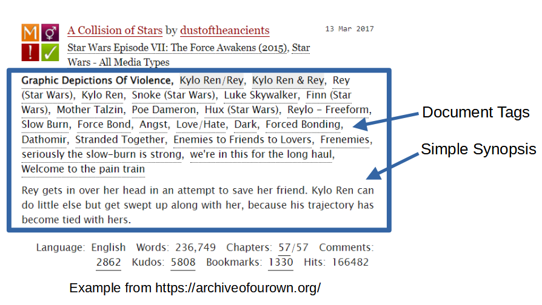
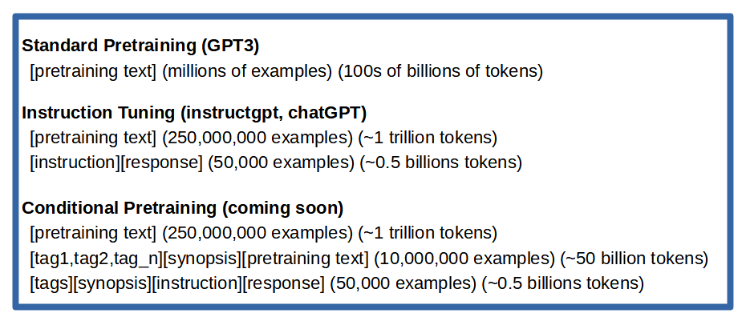

### Conditional Pretraining of Large Language Models

Large language models (LLMs), such as OpenAI's ChatGPT and similar chatbot products from other organizations, have recently gained widespread adoption. These models can extend text or respond to instructions in a natural and helpful manner. Despite the core technologies behind LLMs, namely the transformer architecture and the GPT decoder-only causal language model, remaining relatively unchanged for over five years, the surge in popularity of ChatGPT can be largely attributed to recent approaches that better align the output of LLMs with users' and service providers' intentions.

Two primary approaches have been employed to better align large language models with human expectations. The first is known as supervised finetuning (SFT) on natural instructions, while the second is called reinforcement learning from human feedback (RLHF). Both methods aim to improve the performance and usability of LLMs, but they differ in their implementation. SFT involves training the model using labeled datasets that contain natural instructions, which helps the model understand and respond more accurately to user queries. RLHF, on the other hand, is a technique that uses human preferences as a reward signal to fine-tune models. It involves collecting a dataset of human-written demonstrations on prompts, training supervised learning baselines, and then gathering a dataset of human-labeled comparisons between two model outputs on a larger set of prompts. A reward model (RM) is trained on this dataset to predict which output labelers would prefer, and this RM is used as a reward function to fine-tune the GPT-3 policy using the PPO algorithm. However, there is an "alignment tax" associated with this approach, which can result in worse performance in some situations.
 

**Figure 1.** An example of document tagging on a popular user generated content website. The tags inform potential readers what kind of content will be in the text without spoiling the story.

A third approach to align language models with human expectations in a more transparent and end-user controllable manner is called Conditional Pretraining. In this method, a large number of pretraining examples are tagged with labels that describe the content using human-understandable classifiers. This labeling can be performed in a mostly unsupervised fashion, utilizing encoder-only or encoder-decoder natural language understanding (NLU) machine learning models, such as the BERT or T5 family of models. Content tagging is used in nearly all human generated online information-sharing environments as a way to organize content, and help users find information most relevant to their interests.

There are many widely used tags online that help categorize and filter content based on user preferences. "Suitable for work" (SFW) and "not suitable for work" (NSFW) tags are commonly found on sites like Reddit, Imgur, and various online forums. Additionally, book and movie reviews often utilize the "Spoilers" tag to indicate if the review contains information that may negatively impact the enjoyment of the content. User-generated story sites, such as Archive of Our Own (AO3) and FanFiction.net, employ diverse tags to provide clear indications of the content readers can expect within the stories (Figure 1). Furthermore, labels like G, PG, PG-13, and R, have been utilized for decades to inform users about television and movie content.

By leveraging conditional pretraining, language models could be better adapted to users' interests and preferences, resulting in a more aligned and enjoyable experience.

### Converting Existing Pretraining Data into Conditional Pretraining Data

The prevailing method for training LLMs involves collecting vast quantities of text from the internet and feeding this minimally processed text into the LLM. The pretraining objective is to predict the subsequent word given all prior words in the training example. Often, the text is divided in a manner that allows documents to be fragmented at any point, such as in the middle of a paragraph. These fragments are then randomly incorporated into larger batches of training examples, typically ranging from 2 to 4 million examples per training step. Although this approach has proven effective, it may not be the most optimal way to train these models.
 

**Figure 2.** Comparison of existing LLM training strategies and the conditional pretraining approach. Theoretically every example used to train the model could be tagged.

In contrast, conditional pretraining aims to prepend each training example with a set of descriptive tags and a brief synopsis that accurately represents the text in the training example (Figure 2). These tags and synopses can be efficiently generated using natural language understanding (NLU) models such as BERT or T5. Although there is considerable computational cost associated with processing all the training examples, once the conditional pretraining examples are generated, they become reusable and easily understandable by humans. This approach enhances the training process, resulting in more accurate and user-friendly language models.

### Transparency and Accountability

Another significant advantage of conditional pretraining is the transparency of the tags used on documents, which can be easily understood by auditors or end users of the models. At present, the instructions and reward models employed in most LLMs are proprietary and not available for public review. This lack of transparency makes it challenging to comprehend how and why models respond to culturally or politically sensitive topics. Even when there are disagreements among people about how these models should be aligned and what values they should uphold, it is difficult to engage in meaningful discussions or debates on these sensitive topics as long as the values of the organizations developing the LLMs remain concealed or obscured by carefully crafted press releases and position papers.

